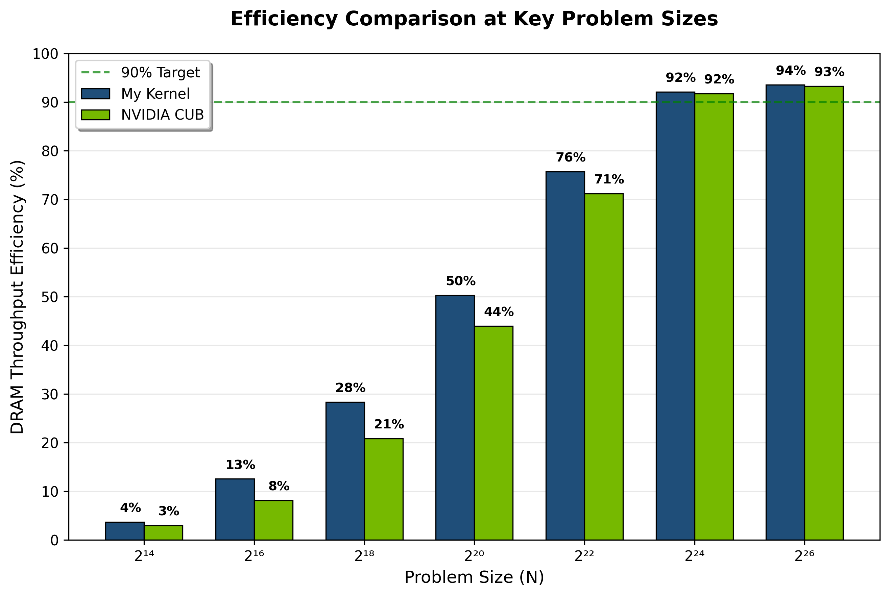

`inclusive-scan` **- GPU prefix sum that hits the roof.**

Faster than NVIDIA CUB at mid-problem sizes. 93.8% of theoretical DRAM bandwidth.

Single-pass fused kernel. Kogge-Stone scan. Decoupled lookback.

---

> RTX 4070 Ti SUPER, CUDA 12.x, Nsight Compute profiled.
