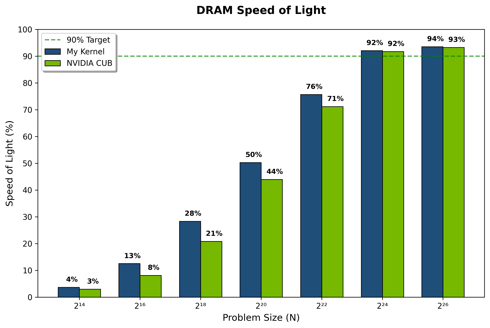

`inclusive-scan` **- Device-wide scan, rivaling NVIDIA CUB.**

GPU prefix sum that hits the roof:

Beats CUB at mid-range. 94% of theoretical DRAM bandwidth.

- Kogge-Stone warp/block scan.
- Decoupled lookback for cross-CTA communication.
- Vectorized loads.

---
> RTX 4070 Ti SUPER, CUDA 12.x, Nsight Compute.

Reviewed by [Georgii Evtushenko (NVIDIA)](https://github.com/gevtushenko).

**Resources:**  
[Single-pass Parallel Prefix (NVIDIA Research)](https://research.nvidia.com/sites/default/files/pubs/2016-03_Single-pass-Parallel-Prefix/nvr-2016-002.pdf)  
[Scan at the Speed of Light (GPU Mode)](https://youtu.be/VLdm3bV4bKo?si=VuQHjQEZw8MF_Jrw)
