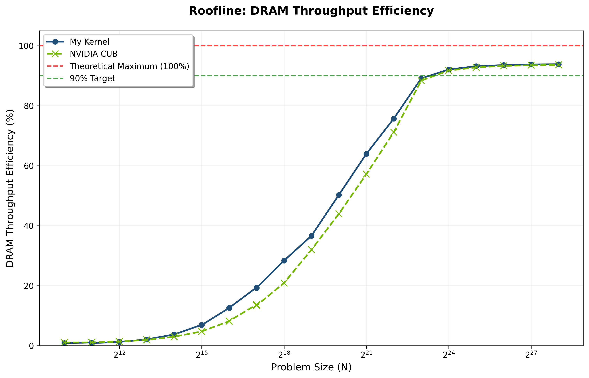

# GPU-Wide Prefix Sum

High-performance CUDA implementation of an **inclusive scan** over large inputs.  A single, fused kernel `single_pass_scan_4x` reaches DRAM throughput on an RTX 4070 Ti SUPER comparable to copy bandwidth and outperforms NVIDIA CUB’s production `DeviceScan::InclusiveSum` by **up to 1.5 ×**.

---

  

Peak throughput: **613 GB/s** (93.4 % of theoretical DRAM bandwidth) at 256 M elements.  
 Up to a **1.5 ×** speed-up over CUB on mid problem sizes.

---

## Algorithm & Kernel

* Serial naive thread scan for vectorized inputs.
* Kogge-Stone scan for inter and intra warp.
* Decoupled look-back (Merrill & Garland) across blocks.
* Single-pass fusion of the traditional three-kernel GPU scan.
* Auto-tuned launch configuration via Bayesian HPO over a Jinja2-templated kernel generator.

---

## Baseline Competitor

[NVIDIA CUB](https://nvidia.github.io/cub/) v2.x `cub::DeviceScan::InclusiveSum` (the standard for GPU prefix-scans).

During profiling we treat CUB’s two internal kernels (`DeviceScanInitKernel`, `DeviceScanKernel`) as a single logical operation and time-weight their metrics for a fair comparison.

---

## Measurement Methodology

1. **Profiler:** `Nvidia Nsight Compute` via `build_and_run.sh profile <N>` 
2. **Metrics scraped:**
   * Memory Throughput (GByte/s)
   * DRAM Throughput (%) - “roofline” efficiency
   * Duration (µs / ms) - converted to seconds for weighting
3. **Problem sizes:** powers of two from 2^10 to 2^28 plus ±1 neighbours to observe cache edge performance.

---

## Correctness Validation

Ran `validate.cu` to exhaustively compare every output
against NVIDIA CUB on a sweep of edge-case vector sizes.

---

Environment-specific tuning (SM clock, power limits) was **disabled** to publish vendor-neutral numbers.
